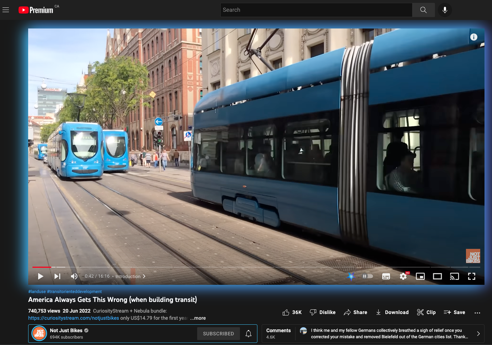

# Nebulate

> ## This application has undergone a substantial re-write. Technical details on this page should not be considered to be reliable until this notice is removed. Due to the changes in Table distribution it is not required to run the server to listen for client messages
  

## Introduction

Nebulate-Node is a backend web scraper and caching server designed to integrate the Nebula and YouTube video platforms, through the use of the [Nebulate](https://github.com/oenu/Nebulate/tree/main/extension) chrome extension included in this repository.

<p align="center">
  
</p>

_Demonstration of the Chrome extension recognizing a Nebula video and the server providing a redirect_

## Table of contents

1. [Motivation](#motivation) - Why I created this project
2. [Composition](#composition) - How this project works
3. [Installation](#installation) - How to install this project
4. [Usage](#usage) - How to use this project once installed
5. [Screenshots](#screenshots) - Screenshots of this project
6. [User Stories](#user-stories) - User stories for this project
7. [Limitations](#limitations) - Limitations of this project
8. [Contributing](#contributing) - How to contribute to this project
9. [Credits](#credits) - Credits for this project
10. [Support](#support) - How to support this project
11. [License](#license) - The license for this project

---

# Motivation

<!-- Why did I make this -->

When using YouTube I often forget to check Nebula for an enhanced version of a video I am watching. This means I end up watching videos that have longer and ad-free versions only to be reminded during a sponsor read for a service I already pay for. I wanted a way to easily see if a video is available in Nebula and to easily watch it. I built this project to solve this problem and hopefully help others who want to support channels on Nebula and use the fantastic service that they pay for.

> This is a personal project built in a week. If you are looking for driven Junior Dev please [get in touch](https://twitter.com/_a_nb)

# Composition

<!-- What is this package -->

### Node Package

This is a Node package that uses a Nebula account to match YouTube videos to Nebula releases. It relies on YouTubes public API to get video information and an undocumented Nebula API. Data is stored in a MongoDB database and a fast lookup table is generated and sent to a GitHub repo where it can be downloaded by clients every 6 hours. This table holds a list of YouTube videos that are known to be from Nebula channels and a list of the videos that are available in Nebula. By using this method clients are able to locally identify nebula creators without having to check in with the Nebulate server.

The mongoDB database holds approximately 44,000 videos at this time and take up around 7MB with lookup tables downloaded by users taking up approximately 360KB (1/4 the size of the screenshots in this file).

### Chrome Extension

This is a Chrome extension that interfaces with the node package to offer video redirects to [Nebula](https://nebula.app/) based on whether a good match candidate exists in the mongoDB database.

# Installation

 <!-- How to install -->

> Note: This package ships with no video data for copyright reasons. Using this package requires you to use your own Nebula login and Youtube API key. If you would like to see a demo please [get in touch](https://twitter.com/_a_nb)

> Note: This package is best deployed via Docker. Due to issues with Docker-Compose caching, the commands to initiate the Docker containers are not specified in this file, if you wish to use this package you will need to follow the instructions below.

> **If you understand Docker and are aware of the limitations of Docker Build Caching you can use the Docker specific Yarn commands specified in the Package file.**

### Node Package

To install this package, run the following command: `yarn install`

You must then create an .env file in the root directory of the project. This file should contain the following variables:

```
// Scraper configs
NEBULA_USERNAME=<username> // Your Nebula account username
NEBULA_PASSWORD=<password> // Your Nebula account password
YOUTUBE_API_KEY=<api key> // Your YouTube API key

// MongoDB connection information
DATABASE_URI=<database uri> // mongodb+srv://<username>:<password>@<cluster>:27017/nebulate?authSource=admin
DATABASE_USERNAME=<username> // Your mongoDB username
DATABASE_PASSWORD=<password> // Your mongoDB password

// Github repository information
GITHUB_TOKEN=<Personal access Token> // Personal github access token for storing the lookup table
GITHUB_USER=<Your github username> // Your github username
GITHUB_REPO=<Github Repo Name> // The repo name for the lookup table

// Auth Configs
AUTH_SECRET=<password> // A password used to authenticate database management functions
```

Once you have created the .env file, you can run the following command to start the server: `yarn build && yarn start` This will attempt to connect to the production database specified in the env file.

If you are not using the dockerfile then you should run the server in development mode by running the following command: `yarn dev`, this will attempt to connect to a local mongoDB instance.

This will start the server and will automatically connect to the database, it will also create the models in the database from the Mongoose schema included in the package.

### Chrome extension

To install the chrome extension dependencies you can run the following command: `yarn install:extension`

To use the extension in Chrome run `yarn build:extension`, open the chrome://extensions page and click the "Add" button. Then click the `Load unpacked extension` button and select the folder that contains the unpacked extension (`dist`).

This will install the extension with the assumption that you are running the server locally, this can be changed in the `/extension/src/background.ts` file.

# Usage

 <!-- How to use this package -->

### Node Package

To run this package run `yarn build && yarn start` this will build the package and start the server on port 3000.

This package has a number of methods that can be called to interact with the database. Requests from Extension users will be accepted and may trigger database functions, but will not be able to trigger database functions directly. Any request that interacts with the database requires a Bearer token, this is specified in .env file.

The database functions are listed in the `/src/index.js` file and are:

```
// Database Functions
PUT: /register_all -- This will register all channels in the database. This is a one time function and should not be run again.
PUT: /update_all_channels -- This will scrape all new videos from all channels, match them and update the database.
PUT: /match_all -- This will match all videos from all channels in the database.
PUT: /uploadTable -- This will attempt to upload the Lookup table to a directory specified in the .ENV, this allows the package to use Github as a low volume hosting provider.

// Individual Functions
PUT: /register/<channel nebula slug> -- This will register a channel in the database and trigger a scrape and match cycle.
PUT: /match/<channel nebula slug> -- This will match all videos from a channel to their releases in Nebula.
PUT: /scrape/nebula/<channel> -- This will scrape all new videos from Nebula and store them in the database.
PUT: /scrape/youtube/<channel> -- This will scrape all new videos from YouTube and store them in the database.

// Public Functions
GET: /api/table -- This will return the lookup table for the database and generate one if it does not exist.
GET: /api/lookup/<youtube video id> -- This will return the Nebula release information for a matched YouTube video. This is the primary method of interacting with the database from the extension.
```

When users click on a video in the extension, the extension will send a request to the server with the video ID. The server will then look up the video in the database and return the Nebula video information if it is available, which is then used to open the video in the browser. This is done to minimize the size of extension and allow for redirects to be updated without updating the extension database.

> Note: This is a proof of concept project and is not intended to be used in production in its current state.

# Screenshots


_Highlighted video and channel have been found on Nebula, a button has been presented to the user to redirect them to the nebula version_


_Video also highlighted in cinema mode_

---

# User-Stories

 <!-- Describe how a user will use this tool, in sentence structure -->

### User 1 - Extension User

#### Who Am I?

I am a user who has installed the extension and is using it while watching videos on YouTube.

#### What do I want?

I want to be shown when a Nebula version of a video is available and I want to be able to be redirected to the Nebula version.

#### Why does this benefit me?

I benefit because I can watch the enhanced version of the video without having to remember each creator individually.

#### Acceptance Criteria

I should be notified of a matching video and have a button to redirect to the Nebula version.

---

### User 2 - System Administrator

#### Who Am I?

I am a system administrator who is using the server to maintain a database of videos.

#### What do I want?

I want the database to automatically be up to date with the latest videos on YouTube and Nebula, and I want to be able to match videos to their releases.

I want to respect API limits while maintaining an accurate database of videos.

#### Why does this benefit me?

I benefit because I can serve user requests and update the database without having to manage each video individually.

I benefit because I will not be rate limited by API's.

#### Acceptance Criteria

I should be able to update the database with new videos and match them to their releases without excessive manual intervention.

My database should only request deep scrapes from API's when absolutely necessary and use cached data when possible.

---

### User 3 - Nebula Creator

#### Who Am I?

I am a Video Creator who is creating videos for Nebula and Youtube

#### What do I want?

I want viewers to have access to the best version of my video regardless of platform.

#### Why does this benefit me?

I benefit because viewers will enjoy my content more, and will continue to support my work through the Nebula platform.

#### Acceptance Criteria

My viewers should be prompted to view Nebula versions of my videos.

---

# Limitations

 <!-- How this package is limited -->

This package does not run jobs on a schedule, it does not have access to internal Nebula APIs, and only matches based on video titles that can vary between platforms. This means that if a video is renamed on YouTube, it will not be matched to a Nebula release.

This package requires a manual mapping of YouTube channels against Nebula channels (Found in `./src/store/youtubeIds.ts`), this is not a complete mapping, but it is a good starting point. This is only used for automated registration and was manually mapped by myself, it is not guaranteed to be accurate.

This package currently only supports the use of the Chrome extension, but may be expanded to support other platforms in the future.

This package does not support the use of a database other than MongoDB, but may be expanded to support other databases in the future.

This package includes basic unit tests but does not include mock api responses due to possible rights implications.

---

# Contributing

<!-- How to contribute to this project -->

If you would like to contribute to this project, please open an issue or pull request on [GitHub](https://github.com/oenu/Nebulate). You can also contact me by creating an issue or pull request and I will reach out to you.

---

# Credits

This project was built by [@oenu](https://github.com/oenu) and utilizes data from the fantastic [Nebula](https://nebula.app/) platform along with data from the [YouTube API](https://developers.google.com/youtube/v3/).

---

# Support

Though I am happy to help if you have any questions or issues, I do not provide any support for this project.

---

# License

This software is licensed under the [Eclipse Public License V2](LICENSE).
